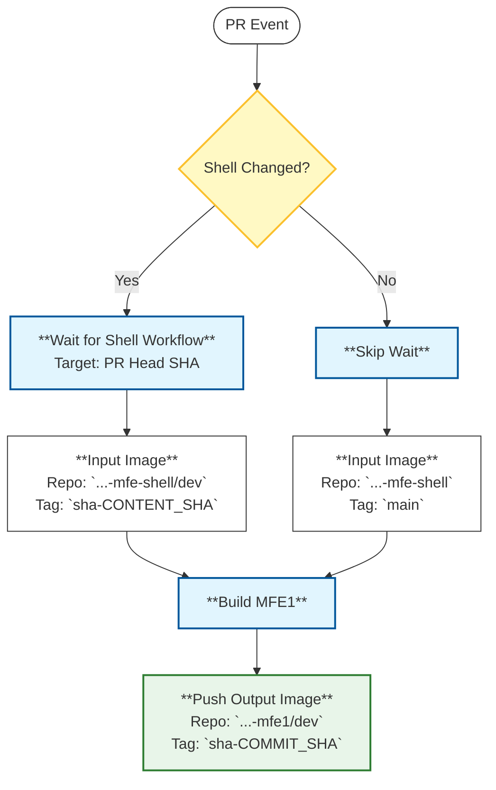
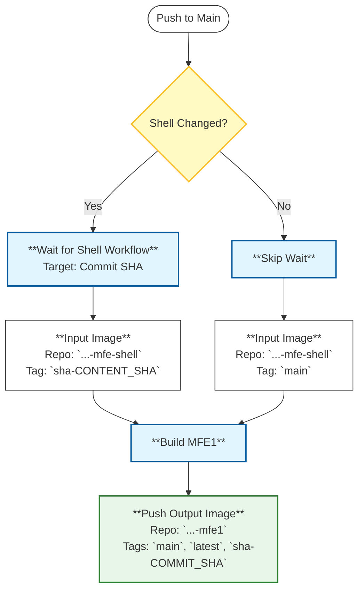

# MFE1 CI/CD Logic

This document describes the logic for the **MFE1** Continuous Integration workflows. The logic is split into two separate workflows to handle Pull Requests and Main Branch merges independently.

## 1. Pull Request Flow (`mfe1-ci-pr.yml`)

This workflow triggers on `pull_request` events targeting `main`. Its primary goal is to verify that changes (in MFE1 or the Shell) build correctly before merging.

### Logic Diagram

### Key Behaviors
*   **Wait Trigger**: Only waits if `mfe-shell` files are modified. Waits for the specific PR Head commit to match the current context.
*   **Shell Image**:
    *   **Changed**: Uses the `dev` image built from the specific content SHA (`dev:sha-<SHA>`).
    *   **Unchanged**: Uses the stable `main` image to save time.
*   **Output**: Always pushes to the development registry (`.../dev`).

---

## 2. Main Branch Flow (`mfe1-ci-main.yml`)

This workflow triggers on `push` events to `main`. It handles production builds and deployment artifacts.

### Logic Diagram

### Key Behaviors
*   **Wait Trigger**: Only waits if `mfe-shell` files are modified in the commit.
*   **Shell Image**:
    *   **Changed**: Uses the production image built from the specific content SHA (`sha-<SHA>`).
    *   **Unchanged**: Uses the stable `main` image.
*   **Output**: Pushes to the production registry with `main`, `latest`, and `sha-<SHA>` tags.
