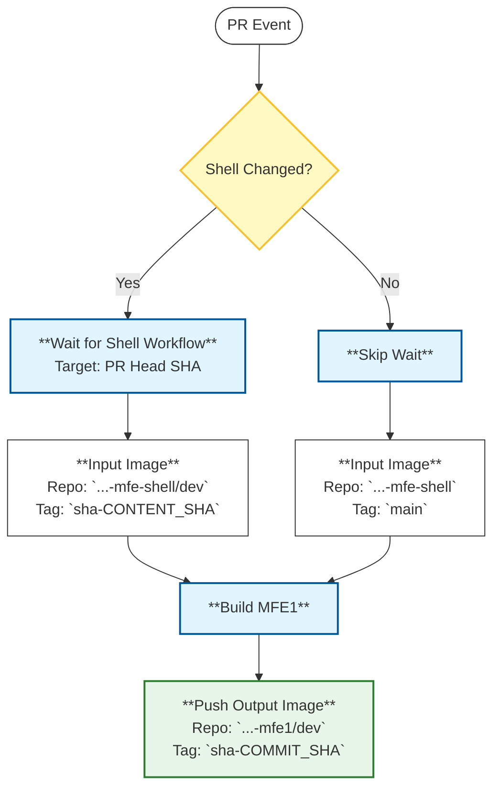
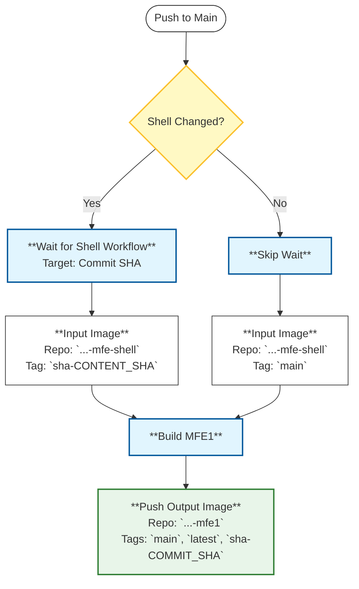
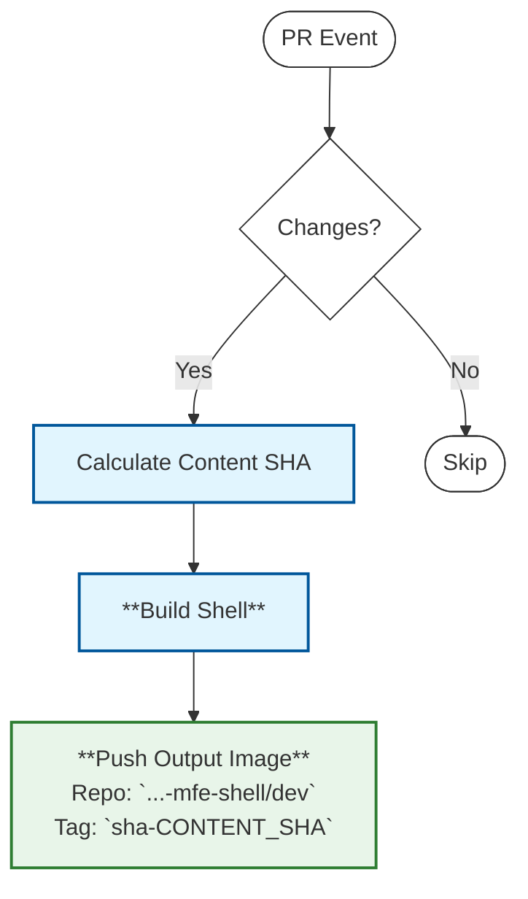
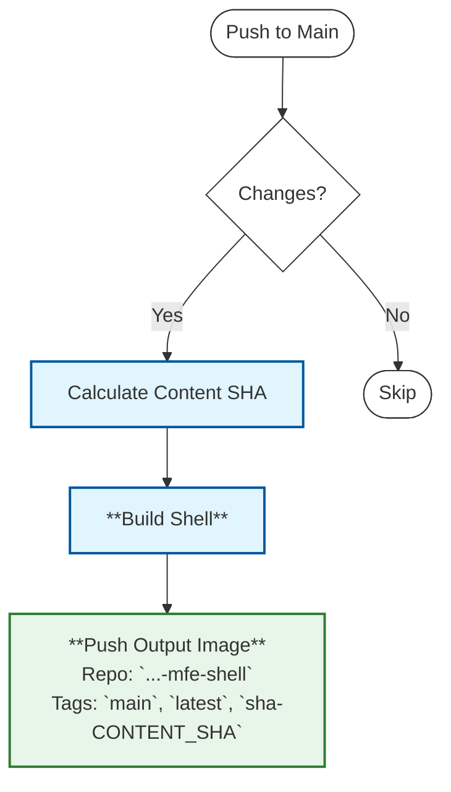

# MFE1 CI/CD Logic

This document describes the logic for the **MFE1** Continuous Integration workflows. The logic is split into two separate workflows to handle Pull Requests and Main Branch merges independently.

## 1. Pull Request Flow (`mfe1-ci-pr.yml`)

This workflow triggers on `pull_request` events targeting `main`. Its primary goal is to verify that changes (in MFE1 or the Shell) build correctly before merging.

### Logic Diagram

```mermaid
flowchart TD
    Start([PR Event]) --> CheckPaths{Shell Changed?}

    %% Decision: Wait or Skip
    CheckPaths -->|Yes| WaitShell[**Wait for Shell Workflow**<br/>Target: PR Head SHA]
    CheckPaths -->|No| SkipWait[**Skip Wait**]

    %% Input Image Selection
    WaitShell --> UseDevInput[**Input Image**<br/>Repo: `...-mfe-shell/dev`<br/>Tag: `sha-CONTENT_SHA`]
    SkipWait --> UseMainInput[**Input Image**<br/>Repo: `...-mfe-shell`<br/>Tag: `main`]

    %% Build & Output
    UseDevInput --> Build[**Build MFE1**]
    UseMainInput --> Build

    Build --> Output[**Push Output Image**<br/>Repo: `...-mfe1/dev`<br/>Tag: `sha-COMMIT_SHA`]

    classDef default fill:#fff,stroke:#333,stroke-width:1px;
    classDef action fill:#e1f5fe,stroke:#01579b,stroke-width:2px;
    classDef decision fill:#fff9c4,stroke:#fbc02d,stroke-width:2px;
    classDef output fill:#e8f5e9,stroke:#2e7d32,stroke-width:2px;

    class WaitShell,Build,SkipWait action;
    class CheckPaths decision;
    class Output output;
```

### Key Behaviors
*   **Wait Trigger**: Only waits if `mfe-shell` files are modified. Waits for the specific PR Head commit to match the current context.
*   **Shell Image**:
    *   **Changed**: Uses the `dev` image built from the specific content SHA (`dev:sha-<SHA>`).
    *   **Unchanged**: Uses the stable `main` image to save time.
*   **Output**: Always pushes to the development registry (`.../dev`).

---

## 2. Main Branch Flow (`mfe1-ci-main.yml`)

This workflow triggers on `push` events to `main`. It handles production builds and deployment artifacts.

### Logic Diagram

```mermaid
flowchart TD
    Start([Push to Main]) --> CheckPaths{Shell Changed?}

    %% Decision: Wait or Skip
    CheckPaths -->|Yes| WaitShell[**Wait for Shell Workflow**<br/>Target: Commit SHA]
    CheckPaths -->|No| SkipWait[**Skip Wait**]

    %% Input Image Selection
    WaitShell --> UseProdInput[**Input Image**<br/>Repo: `...-mfe-shell`<br/>Tag: `sha-CONTENT_SHA`]
    SkipWait --> UseMainInput[**Input Image**<br/>Repo: `...-mfe-shell`<br/>Tag: `main`]

    %% Build & Output
    UseProdInput --> Build[**Build MFE1**]
    UseMainInput --> Build

    Build --> Output[**Push Output Image**<br/>Repo: `...-mfe1`<br/>Tags: `main`, `latest`, `sha-COMMIT_SHA`]

    classDef default fill:#fff,stroke:#333,stroke-width:1px;
    classDef action fill:#e1f5fe,stroke:#01579b,stroke-width:2px;
    classDef decision fill:#fff9c4,stroke:#fbc02d,stroke-width:2px;
    classDef output fill:#e8f5e9,stroke:#2e7d32,stroke-width:2px;

    class WaitShell,Build,SkipWait action;
    class CheckPaths decision;
    class Output output;
```

### Key Behaviors
*   **Wait Trigger**: Only waits if `mfe-shell` files are modified in the commit.
*   **Shell Image**:
    *   **Changed**: Uses the production image built from the specific content SHA (`sha-<SHA>`).
    *   **Unchanged**: Uses the stable `main` image.
*   **Output**: Pushes to the production registry with `main`, `latest`, and `sha-<SHA>` tags.

# MFE Shell CI Logic

The MFE Shell workflows are responsible for building the base shell image consumed by MFE1.

## 3. Shell PR Flow (`mfe-shell-ci-pr.yml`)

Triggers on `pull_request` to `main` when shell files change.

### Logic Diagram

```mermaid
flowchart TD
    Start([PR Event]) --> CheckPaths{Changes?}

    CheckPaths -->|Yes| CalcSHA[Calculate Content SHA]
    CheckPaths -->|No| Skip([Skip])

    CalcSHA --> Build[**Build Shell**]

    Build --> Output[**Push Output Image**<br/>Repo: `...-mfe-shell/dev`<br/>Tag: `sha-CONTENT_SHA`]

    classDef default fill:#fff,stroke:#333,stroke-width:1px;
    classDef action fill:#e1f5fe,stroke:#01579b,stroke-width:2px;
    classDef output fill:#e8f5e9,stroke:#2e7d32,stroke-width:2px;

    class CalcSHA,Build action;
    class Output output;
```

*   **Output**: Pushes to `...-mfe-shell/dev`.
*   **Tagging**: Uses the SHA of the content (`mfe-shell-container/`) to ensure the tag is specific to the code content.

## 4. Shell Main Flow (`mfe-shell-ci-main.yml`)

Triggers on `push` to `main` when shell files change.

### Logic Diagram

```mermaid
flowchart TD
    Start([Push to Main]) --> CheckPaths{Changes?}

    CheckPaths -->|Yes| CalcSHA[Calculate Content SHA]
    CheckPaths -->|No| Skip([Skip])

    CalcSHA --> Build[**Build Shell**]

    Build --> Output[**Push Output Image**<br/>Repo: `...-mfe-shell`<br/>Tags: `main`, `latest`, `sha-CONTENT_SHA`]

    classDef default fill:#fff,stroke:#333,stroke-width:1px;
    classDef action fill:#e1f5fe,stroke:#01579b,stroke-width:2px;
    classDef output fill:#e8f5e9,stroke:#2e7d32,stroke-width:2px;

    class CalcSHA,Build action;
    class Output output;
```

*   **Output**: Pushes to `...-mfe-shell` (prod).
*   **Tagging**: Updates `main` and `latest` tags, ensuring downstream consumers (like MFE1) pick up the new base image.

---

## 5. Automated Deployment Flow (`update-fluxcd.yml`)

This workflow triggers on `push` to `main` when any of the Docker containers or CI workflows for `mfe-shell`, `mfe1`, or `mfe2` are modified. Its goal is to synchronize the new Docker image tags with the FluxCD manifests repository and automatically propose a deployment.

### Logic Diagram

```mermaid
flowchart TD
    Start([Push to Main]) --> CheckPaths{Which Apps Changed?}

    CheckPaths --> |MFE Shell| WaitShell[Wait for Shell CI]
    CheckPaths --> |MFE 1| WaitMFE1[Wait for MFE1 CI]
    CheckPaths --> |MFE 2| WaitMFE2[Wait for MFE2 CI]

    WaitShell --> GetSHAs[Get Last Git Commit SHAs]
    WaitMFE1 --> GetSHAs
    WaitMFE2 --> GetSHAs

    GetSHAs --> InjectTags[Inject Tags into FluxCD YAMLs via yq]

    InjectTags --> CheckDiff{Are Tags Different?}

    CheckDiff --> |Yes| CreatePR[Create Auto-Merging PR]
    CheckDiff --> |No| Skip([Skip])

    classDef default fill:#fff,stroke:#333,stroke-width:1px;
    classDef action fill:#e1f5fe,stroke:#01579b,stroke-width:2px;
    classDef decision fill:#fff9c4,stroke:#fbc02d,stroke-width:2px;
    classDef output fill:#e8f5e9,stroke:#2e7d32,stroke-width:2px;

    class WaitShell,WaitMFE1,WaitMFE2,GetSHAs,InjectTags,CreatePR action;
    class CheckPaths,CheckDiff decision;
```

### Key Behaviors
*   **Conditional Waiting**: The script inspects the path-checker outputs and dynamically waits only for the specific CI workflows that were expected to run in this commit, pausing up to 30 minutes.
*   **Skip Cascading Immunity**: When apps like MFE1 or MFE2 do not detect any shell dependency updates, their local `wait-for-shell` jobs internally bypass their steps rather than returning a "Skipped" status. This prevents GitHub Actions from skip-cascading and failing the entire CI workflow run.
*   **Git Log SHA Matching**: Because Docker images are tagged with the specific commit SHA that last altered their contents, `update-fluxcd.yml` extracts the same SHA using `git log -1` tailored to that component's files.
*   **Unconditional Updates**: The workflow unconditionally writes these SHAs to all three `mfe-shell.yaml`, `mfe1.yaml`, and `mfe2.yaml` manifests in `fluxcd-dev`. It relies on `git diff` to naturally ignore any file that hasn't actually mutated.
