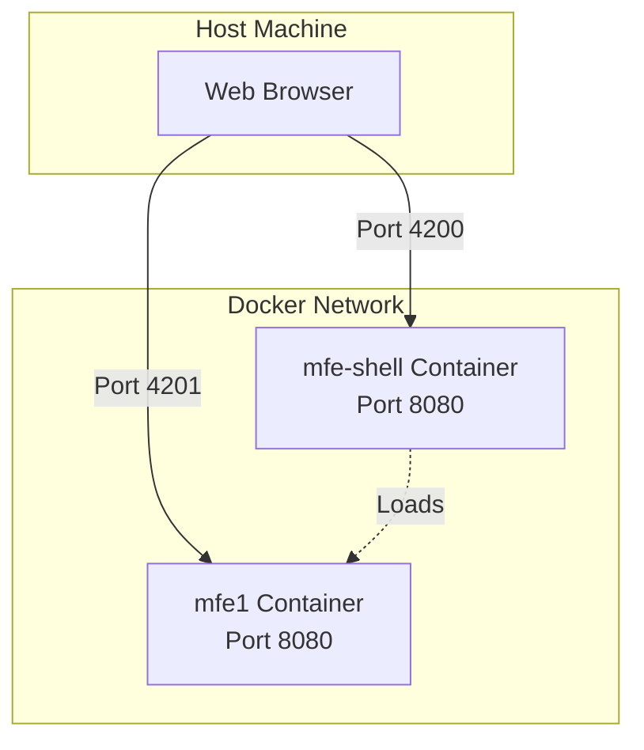

# MFE Shell & Micro Frontend Architecture

This repository demonstrates a **Micro Frontend (MFE)** architecture using **Angular and Native Federation**. It consists of a Shell application (Host) that dynamically loads a remote Micro Frontend (MFE1), alongside a Shared Library (`mfe-shared`) that ensures state management and singleton services across the federation.

## 🚀 Tech Stack

- **Framework**: Angular 19
- **Federation**: Native Federation (Standard-compliant, no Webpack needed)
- **Build Tool**: Angular CLI / Esbuild
- **Testing**: Vitest
- **Containerization**: Docker

## 🏗️ Architecture

The project is structured into three main parts:

1.  **Shell (`mfe-shell-container`)**: The host application that bootstraps the federation and loads remotes.
2.  **Remote (`mfe1-container`)**: A standalone micro frontend that exposes components to the Shell.
3.  **Shared Library (`mfe-shared`)**: located within `mfe-shell-container/projects/mfe-shared`. It contains shared logic, state, or UI components.
    - **Critical**: This library must be a **singleton** shared between the Shell and MFE1 to ensure they share the same state instance.

## 📋 Prerequisites

- **Node.js** (v18+ recommended)
- **npm**
- **Docker** (optional, for containerization)

## ⚡ Quick Start

A `Makefile` is provided to streamline common tasks.

### 1. Install Dependencies
```bash
make install
```
*This installs dependencies for both the Shell and MFE1.*

### 2. Run in Development Mode
The easiest way to run the full system.
```bash
make dev
```
- **Shell**: http://localhost:4200
- **MFE1**: http://localhost:4200/mfe1 (loaded inside shell) or standalone at http://localhost:3000

---

## 🛠️ Detailed Development Setup (Manual)

If you need to set up the environment manually or understand the "Magic" behind the shared state, follow these steps.

### Why `npm link`?
Because `mfe-shared` is a local library that both the Shell and MFE1 depend on as a package, we use `npm link` to symlink the local build to `node_modules`. This guarantees that both applications resolve the **exact same physical files**, ensuring the Singleton pattern works correctly.

### Step-by-Step Setup

1.  **Build the Shell & Shared Library**
    ```bash
    cd mfe-shell-container && npm run build
    ```
    *This compiles `mfe-shared` into `dist/mfe-shared`.*

2.  **Create Global Link for Shared Lib**
    ```bash
    # You can also use `make mfe1-shared` to handle linking automatically
    cd mfe-shell-container/dist/mfe-shared && npm link
    ```


3.  **Link in Shell**
    ```bash
    cd ../../.. # Back to root
    cd mfe-shell-container && npm link mfe-shared
    ```

4.  **Link in MFE1**
    ```bash
    cd ../mfe1-container && npm link mfe-shared
    ```

5.  **Start Applications**
    - **Shell**: `npm start` (in `mfe-shell-container`)
    - **MFE1**: `npm start` (in `mfe1-container`)

## 🐳 Docker Support

You can build and run the containers using the Makefile:

```bash
# Build and run the shell
make mfe-shell-docker-run

# Build and run MFE1 (this will also build the shell as a dependency)
make mfe1-docker-run
```

The default ports are:
-   **mfe-shell**: 4200 (mapped to container port 8080)
-   **mfe1**: 4201 (mapped to container port 8080)

You can override these ports by setting the variables in the Makefile or environment:
```bash
make mfe-shell-docker-run mfe-shell_PORT=5000
```

## 🏗️ Architecture



## 📂 Project Structure

```text
├── mfe-shell-container/       # HOST Application
│   ├── projects/
│   │   └── mfe-shared/        # SHARED Library (Singleton)
│   ├── src/                   # Shell Source Code
│   ├── federation.config.js   # Native Federation Config
│   └── Dockerfile
├── mfe1-container/            # REMOTE Application
│   ├── src/                   # MFE1 Source Code
│   ├── federation.config.js   # Native Federation Config
│   └── Dockerfile
└── Makefile                   # Automation Scripts
```
