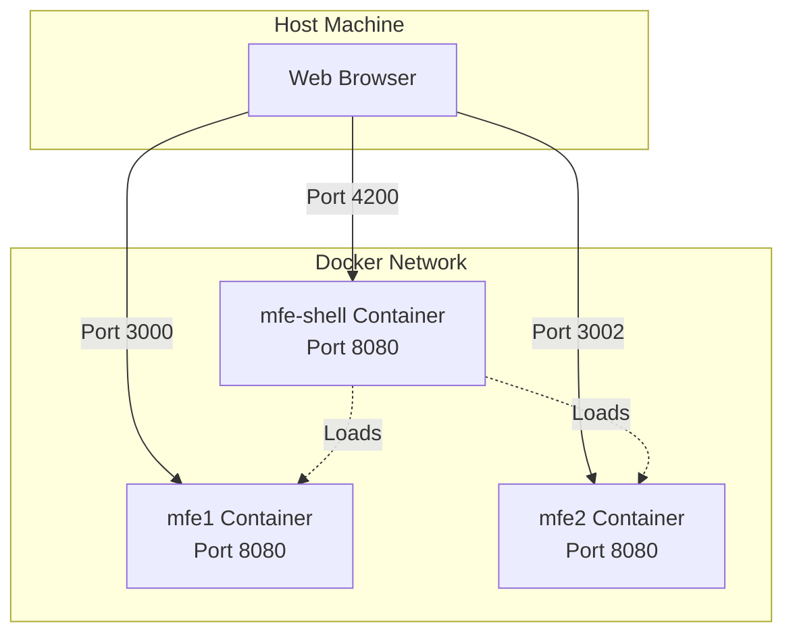

# MFE Shell & Micro Frontend Architecture

This repository demonstrates a **Micro Frontend (MFE)** architecture using **Angular and Native Federation**. It consists of a Shell application (Host) that dynamically loads remote Micro Frontends (MFE1 in Angular, MFE2 in React), alongside a Shared Library (`mfe-shared`) that ensures state management and singleton services across the federation.

## 🚀 Tech Stack

- **Framework**: Angular 21, React 18
- **Federation**: Native Federation (Standard-compliant, no Webpack needed)
- **Build Tool**: Angular CLI / Esbuild
- **Testing**: Vitest
- **Containerization**: Docker

## 🏗️ Architecture

The project is structured into four main parts:

1.  **Shell (`mfe-shell-container`)**: The host application that bootstraps the federation and loads remotes.
2.  **Remote (`mfe1-container`)**: A standalone Angular micro frontend that exposes components to the Shell.
3.  **Remote (`mfe2-container`)**: A standalone React micro frontend integrated using a `GenericMfeWrapperComponent` which dynamically loads the remote module and invokes its `mount`/`unmount` functions.
4.  **Shared Library (`mfe-shared`)**: located within `mfe-shell-container/projects/mfe-shared`. It contains shared logic, state, or UI components.
    - **Critical**: This library must be a **singleton** shared between the Shell and MFE1 to ensure they share the same state instance. MFE2 duplicates the `UserContext` interface locally instead of linking the Angular-based shared library directly.

## 📋 Prerequisites

- **Node.js** (v18+ recommended)
- **npm**
- **Docker** (optional, for containerization)

## ⚡ Quick Start

A `Makefile` is provided to streamline common tasks.

### 1. Install Dependencies
```bash
make install
```
*This installs dependencies for the Shell, MFE1, and MFE2.*

### 2. Run in Development Mode
To run the full system, you need to start each application:

**Start the Shell**
```bash
make mfe-shell-dev
```
- **Shell URL**: http://localhost:4200

**Start MFE1**
```bash
make mfe1-dev
```
- **MFE1 URL**: standalone at http://localhost:3000

**Start MFE2**
```bash
make mfe2-dev
```
- **MFE2 URL**: standalone at http://localhost:3002

---

## 🛠️ Detailed Development Setup (Manual)

If you need to set up the environment manually or understand the "Magic" behind the shared state, follow these steps.

### Why `npm link`?
Because `mfe-shared` is a local library that both the Shell and MFE1 depend on as a package, we use `npm link` to symlink the local build to `node_modules`. This guarantees that both applications resolve the **exact same physical files**, ensuring the Singleton pattern works correctly.

### Step-by-Step Setup

1.  **Build the Shell & Shared Library**
    ```bash
    cd mfe-shell-container && npm run build
    ```
    *This compiles `mfe-shared` into `dist/mfe-shared`.*

2.  **Create Global Link for Shared Lib**
    ```bash
    # You can also use `make mfe1-shared` to handle linking automatically
    cd mfe-shell-container/dist/mfe-shared && npm link
    ```


3.  **Link in Shell**
    ```bash
    cd ../../.. # Back to root
    cd mfe-shell-container && npm link mfe-shared
    ```

4.  **Link in MFE1**
    ```bash
    cd ../mfe1-container && npm link mfe-shared
    ```

5.  **Start Applications**
    - **Shell**: `npm start` (in `mfe-shell-container`)
    - **MFE1**: `npm start` (in `mfe1-container`)

## 🧩 Adding a New Micro Frontend

To add a new Micro Frontend to the Shell, you do not need to make deep code changes to the Shell itself. The integration is largely configuration-driven.

### 1. Content & UI
- **Location**: All UI content, views, and routing for your feature should live **inside the MFE**.
- **Animations**: The Shell provides the slide-in/slide-out route transitions automatically. You do **not** need to implement any route animations inside the MFE. The MFE simply needs to render its content, and the Shell will wrap and animate it when the route changes.
- **Recommendation**: To ensure smooth sliding animations, make sure your remote components occupy `100%` height and width of their container.

### 2. Shared State & Logic (`mfe-shared`)
If your MFE is Angular-based, you can leverage the `mfe-shared` singleton library for shared state and services.
- **Available services**: The library exposes services like `SharedContextService` for user context/state and `SharedHttpService` for unified API calls.
- **Usage**: Import them from `mfe-shared` in your MFE just like any other Angular service. Since `mfe-shared` is linked globally, the Shell and your MFE will share the exact same instance in memory at runtime.

### 3. Exposing the MFE
Your remote application needs to expose an entry point for the Shell to load.
- **Angular (Native Federation)**: In `federation.config.js`, expose your main component or routing module. For example: `exposes: { './routes': './src/app/app.routes.ts' }`.
- **React (Esbuild)**: Expose a mountable component.
- Serve the MFE so that `remoteEntry.json` is accessible.

### 4. Updating the Shell Configuration
The Shell dynamically loads routes and menus at runtime via `mfe-shell-container/public/assets/contents/shell-config.json`.
To hook up your new MFE, update this file:

1. **`remotes`**: Map a remote name to your `remoteEntry.json` URL.
   ```json
   "remotes": { "my-new-mfe": "http://localhost:3003/remoteEntry.json" }
   ```
2. **`mfeRoutes`**: Define how the Shell should load your remote.
   ```json
   {
       "path": "my-mfe-route",
       "displayName": "My New Feature",
       "remoteName": "my-new-mfe",
       "exposedModule": "./routes",
       "componentName": "remoteRoutes"
   }
   ```
   *(Note: The Shell uses a heuristic to determine how to wrap the MFE. If `exposedModule` ends with `routes` or `componentName` is `remoteRoutes`, it assumes native Angular routing. Otherwise, it uses a generic framework-agnostic wrapper).*
3. **`menu`**: Add an entry for the sidebar navigation.
   ```json
   {
       "name": "My Feature Menu Link",
       "route": "/home/my-mfe-route"
   }
   ```

## 🐳 Docker Support

You can build and run the containers using the Makefile:

```bash
# Build and run the shell
make mfe-shell-docker-run

# Build and run MFE1 (this will also build the shell as a dependency)
make mfe1-docker-run

# Build and run MFE2
make mfe2-docker-run
```

The default ports are:
-   **mfe-shell**: 4200 (mapped to container port 8080)
-   **mfe1**: 3000 (mapped to container port 8080)
-   **mfe2**: 3002 (mapped to container port 8080)

You can override these ports by setting the variables in the Makefile or environment:
```bash
make mfe-shell-docker-run mfe-shell_PORT=5000
```

## 🏗️ Architecture


```mermaid
graph TD
    subgraph "Host Machine"
        Browser[Web Browser]
    end

    subgraph "Docker Network"
        Shell[mfe-shell Container<br/>Port 8080]
        MFE1[mfe1 Container<br/>Port 8080]
        MFE2[mfe2 Container<br/>Port 8080]
    end

    Browser -->|Port 4200| Shell
    Browser -->|Port 3000| MFE1
    Browser -->|Port 3002| MFE2

    Shell -.->|Loads| MFE1
    Shell -.->|Loads| MFE2
```

## 📂 Project Structure

```text
├── mfe-shell-container/       # HOST Application
│   ├── projects/
│   │   └── mfe-shared/        # SHARED Library (Singleton)
│   ├── src/                   # Shell Source Code
│   ├── federation.config.js   # Native Federation Config
│   └── Dockerfile
├── mfe1-container/            # REMOTE Application (Angular)
│   ├── src/                   # MFE1 Source Code
│   ├── federation.config.js   # Native Federation Config
│   └── Dockerfile
├── mfe2-container/            # REMOTE Application (React)
│   ├── src/                   # MFE2 Source Code
│   ├── build.js               # Esbuild Config
│   └── Dockerfile
└── Makefile                   # Automation Scripts
```
