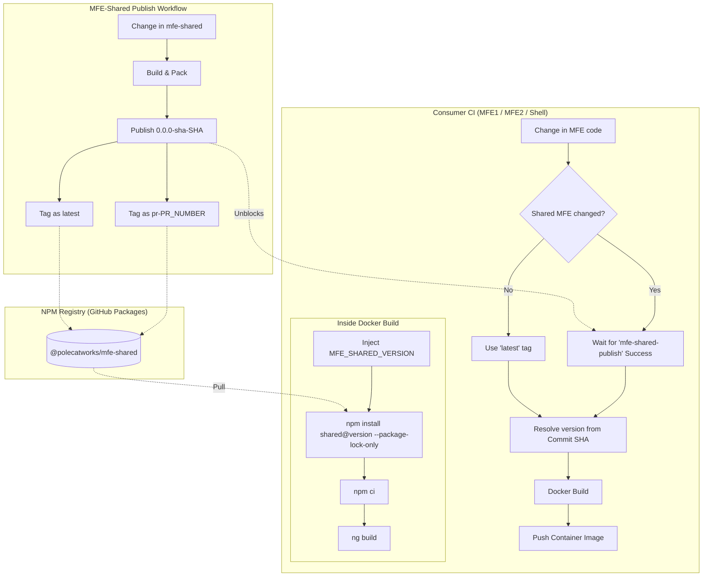

# @polecatworks/mfe-shared

Shared utilities, services (Otel, Context), and types for the PolecatWorks Micro-Frontend ecosystem.

## Installation

This package is published to the **GitHub Packages NPM Registry**.

1. Create a [GitHub Personal Access Token (PAT)](https://github.com/settings/tokens) with `read:packages` scope.
2. Add an `.npmrc` file to your project root (or update your global `~/.npmrc`):
   ```text
   @polecatworks:registry=https://npm.pkg.github.com
   //npm.pkg.github.com/:_authToken=YOUR_GITHUB_PAT
   ```
3. Install the package:
   ```bash
   npm install @polecatworks/mfe-shared
   ```

## Usage

Import services or types directly:

```typescript
import { SharedContextService } from '@polecatworks/mfe-shared';
```

## Development & Local Linking

When making changes to `mfe-shared`, you should use `npm link` to see changes in your consumer applications (Shell, MFE1, etc.) without publishing.

### 1. Build and Link the Library
From the **Mfe-shell** repository root:
```bash
make mfe-shared-dev
```
*(This runs `ng build mfe-shared` and then `npm link` inside the `dist/mfe-shared` directory.)*

### 2. Link in Consumer App
From your consumer app directory (e.g., `mfe1-container`):
```bash
npm link @polecatworks/mfe-shared
```

### 3. Iterating
Whenever you change code in `projects/mfe-shared`, re-run `make mfe-shared-dev`. The linked consumer apps will pick up the changes automatically (usually triggering a rebuild if running in dev mode).

## CI/CD Architecture

The `mfe-shared` package uses a robust synchronization strategy to prevent race conditions during the build of consumer micro-frontends (MFEs).

### 1. Unique SHA Tagging
GitHub Packages does not allow overwriting existing versions. To handle this, every build publishes a unique version string based on the git commit SHA:
- **Unique Version**: `0.0.0-sha-<commit-sha>`
- **Dist-Tags**: 
  - **PRs**: Tagged as `pr-<pr-number>`.
  - **Main**: Tagged as `main` and `latest`.

### 2. Synchronization Strategy
Consumer builds (MFE1, MFE2, Shell) include a "Wait for Shared" job that polls the GitHub API to ensure the `mfe-shared-publish` workflow has completed successfully before starting their own Docker builds.

### 3. Pipeline Flow
The following diagram depicts how `mfe-shared` changes move through the registry and into consumer builds:



