# MFE Shell - Architecture Overview

**Document Status:** ACTIVE  
**Version:** 1.0  
**Date:** 2026-03-14  

---

## Table of Contents

1. [High-Level Architecture](#high-level-architecture)
2. [System Components](#system-components)
3. [Micro Frontend Remotes](#micro-frontend-remotes)
4. [Module Federation](#module-federation)
5. [Shared Library Pattern](#shared-library-pattern)
6. [Deployment Architecture](#deployment-architecture)
7. [Data Flow](#data-flow)
8. [Technology Stack](#technology-stack)

---

## High-Level Architecture

### System Overview

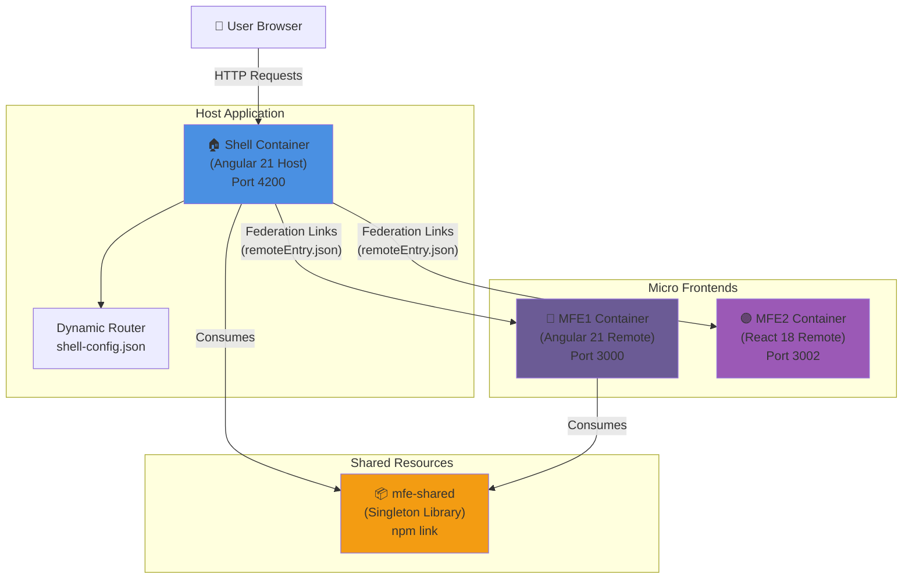

**Key Characteristics:**
- **Host:** Angular 21 shell application serving as the federated host
- **Remotes:** Angular and React micro frontends dynamically loaded at runtime
- **Shared State:** Singleton library (mfe-shared) for state consistency
- **Configuration-Driven:** Runtime configuration for MFE discovery (no code changes needed)

---

## System Components

### 1. Shell Container (Host Application)

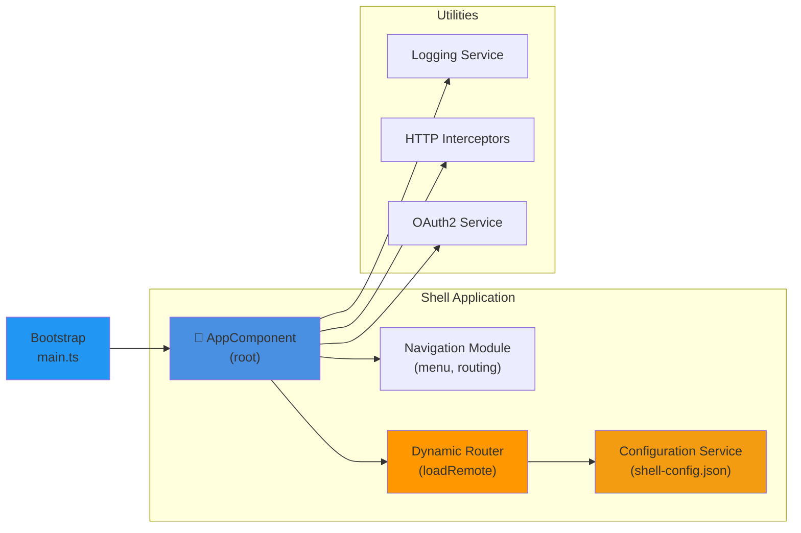

**Responsibilities:**
- **Bootstrap:** Initialize the federated host
- **Navigation:** Manage top-level navigation and menu
- **Dynamic Routing:** Load and render remotes based on routes
- **Configuration:** Read runtime configuration for MFE discovery
- **Shared Services:** Provide logging, HTTP, authentication

**Location:** `mfe-shell-container/src/app/`

---

### 2. MFE1 - Angular Remote

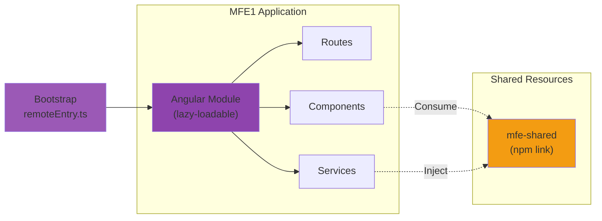

**Characteristics:**
- **Framework:** Angular 21
- **Module Exposed:** Exposes lazy-loadable module for host
- **Shared Library:** Consumes mfe-shared for state consistency
- **Testing:** Karma/Jasmine for unit tests
- **Port:** 3000 (development) / 8080 (Docker internal)

**Location:** `mfe1-container/src/app/`

---

### 3. MFE2 - React Remote

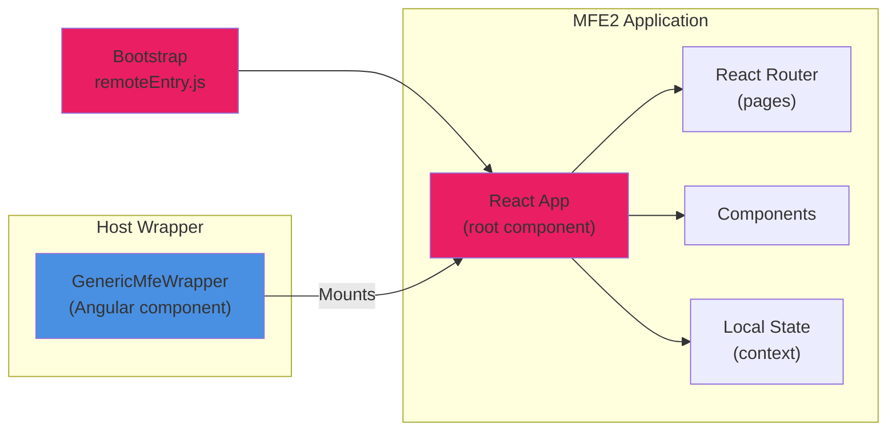

**Characteristics:**
- **Framework:** React 18
- **Module Exposed:** Exposes App component for host
- **Wrapper:** GenericMfeWrapperComponent handles React integration
- **State:** Local React context (not linked to mfe-shared by design)
- **Testing:** None configured (identified as gap)
- **Port:** 3002 (development) / 8080 (Docker internal)

**Location:** `mfe2-container/src/`

---

### 4. Shared Library (mfe-shared)

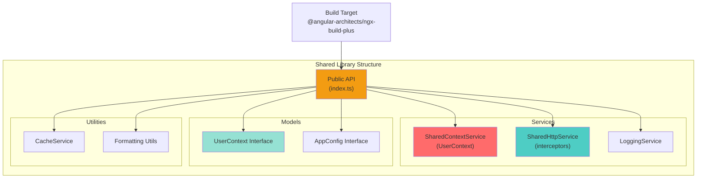

**Characteristics:**
- **Type:** Singleton library (via npm link)
- **Purpose:** Share state and services across Shell and MFE1
- **Linking:** Must run `make mfe1-shared` before starting
- **Served As:** npm local dependency with file: protocol
- **Packages:** SharedContextService, SharedHttpService, UserContext

**Location:** `mfe-shell-container/projects/mfe-shared/`

---

## Micro Frontend Remotes

### Runtime Configuration (shell-config.json)

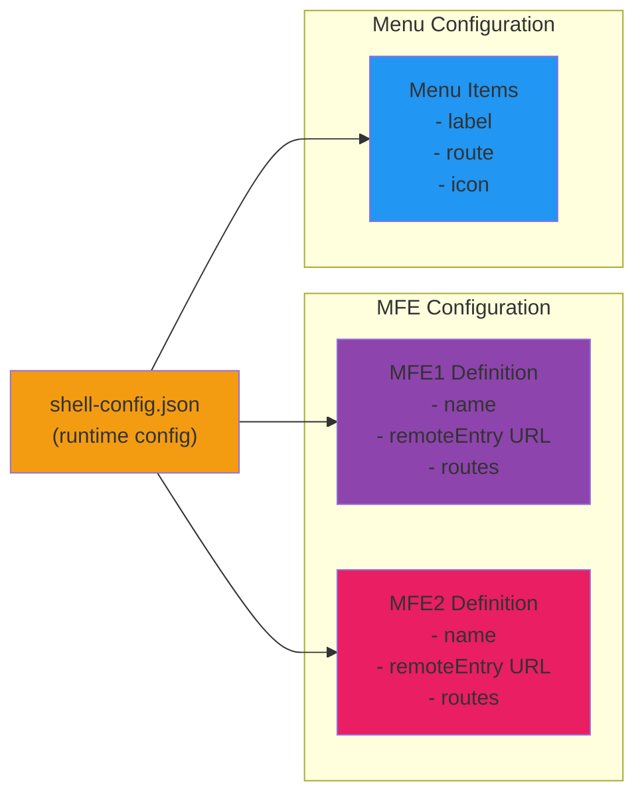

**Key Feature:** Configuration-driven MFE discovery enables:
- Adding new MFEs without code changes
- Runtime route registration
- Dynamic menu generation
- Environment-specific configurations (dev/staging/prod)

---

## Module Federation

### Federation Architecture

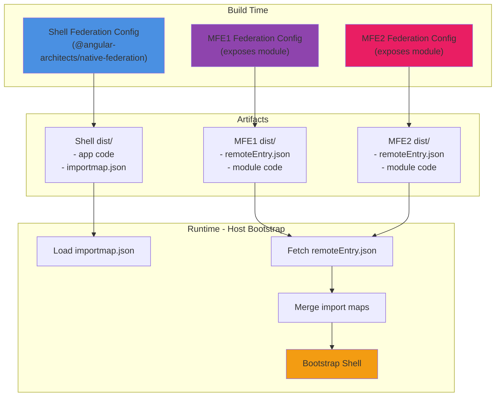

**Key Points:**
- **Standard:** Uses @angular-architects/native-federation (not Webpack-dependent)
- **Dynamic Loading:** Remotes loaded at runtime via remoteEntry.json
- **Import Maps:** ES module import maps for module resolution
- **Decoupled:** MFEs built independently, referenced dynamically

---

## Shared Library Pattern

### npm link Mechanism

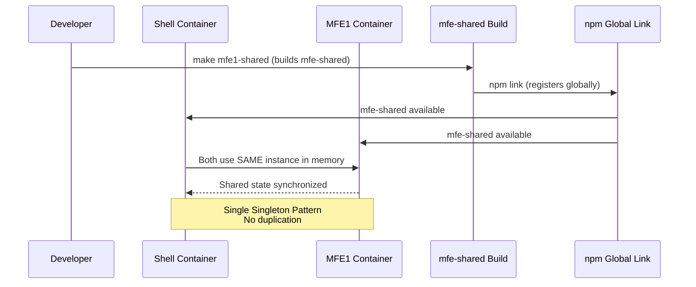

**Benefits:**
- **Singleton:** Both Shell and MFE1 use exact same in-memory instance
- **Consistency:** Shared state stays in sync across applications
- **Development:** Changes to shared lib reflect immediately (no rebuild)
- **Type Safety:** Shared TypeScript interfaces across boundaries

**Setup:**
```bash
# First time setup
npm link

# Development workflow
make mfe1-shared    # Build shared library
npm start           # Start Shell (links to shared)
```

---

## Deployment Architecture

### Docker Deployment

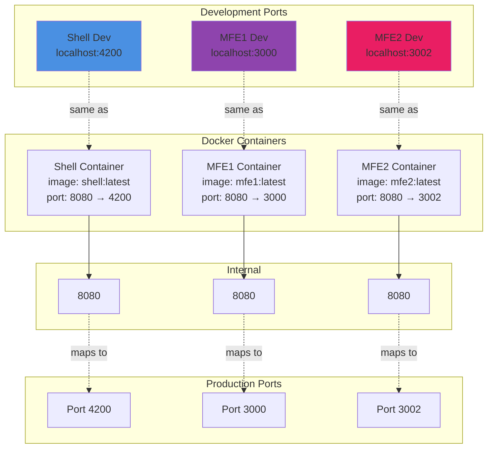

**Port Mapping:**
| Component | External | Internal | Purpose |
|-----------|----------|----------|---------|
| Shell | 4200 | 8080 | Host application |
| MFE1 | 3000 | 8080 | Angular remote |
| MFE2 | 3002 | 8080 | React remote |

**Container Orchestration:**
- Each container can run independently
- Or run together via docker-compose (future feature)
- Health checks validate container readiness
- Environment-aware configuration (dev/prod)

---

## Data Flow

### User Request to Remote Component Load

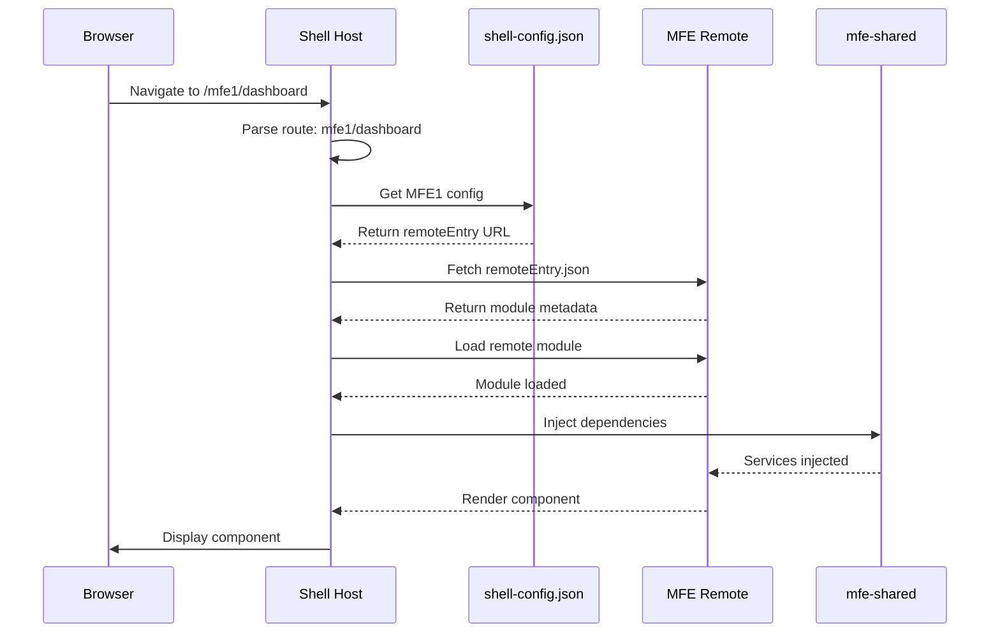

### State Synchronization (Shell ↔ MFE1)

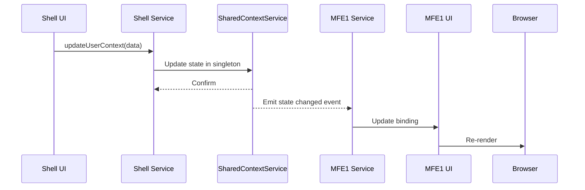

**Key Pattern:**
- Services inject SharedContextService
- All state changes go through shared service
- Services subscribe to state changes
- UI updates automatically when state changes

---

## Technology Stack

### Frontend Stack

```mermaid
graph TB
    subgraph "Shell"
        ShellFrame["Angular 21.1"]
        ShellBuild["Angular CLI + Vite"]
        ShellTest["Vitest"]
    end
    
    subgraph "MFE1"
        MFE1Frame["Angular 21.1"]
        MFE1Build["Angular CLI + Vite"]
        MFE1Test["Karma + Jasmine"]
    end
    
    subgraph "MFE2"
        MFE2Frame["React 18"]
        MFE2Build["Custom build.js"]
        MFE2Test["None (Gap)"]
    end
    
    subgraph "Federation"
        Federation["@angular-architects<br/>native-federation"]
    end
    
    subgraph "Shared"
        SharedLib["mfe-shared (Angular)"]
        SharedState["SharedContextService"]
    end
    
    ShellFrame --> Federation
    MFE1Frame --> Federation
    MFE2Frame --> Federation
    
    ShellFrame --> SharedLib
    MFE1Frame --> SharedLib
    
    SharedLib --> SharedState
    
    style ShellFrame fill:#4A90E2
    style MFE1Frame fill:#8E44AD
    style MFE2Frame fill:#E91E63
    style Federation fill:#F39C12
    style SharedLib fill:#FF9800
```

### Infrastructure Stack

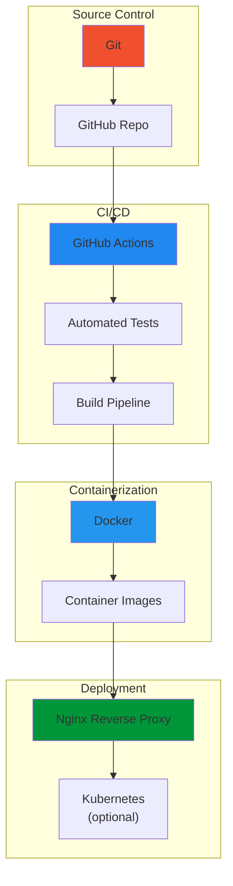

---

## Architecture Decisions

### 1. Native Federation (not Webpack Module Federation)
**Decision:** Use @angular-architects/native-federation  
**Rationale:** Standards-compliant, not Webpack-dependent, supports mixed frameworks  
**Trade-off:** ES module syntax, requires modern browser support

### 2. Singleton Shared Library via npm link
**Decision:** Use npm link for mfe-shared singleton pattern  
**Rationale:** Single in-memory instance, simple development workflow  
**Trade-off:** Requires prerequisite setup, manual linking

### 3. Configuration-Driven MFE Discovery
**Decision:** Runtime configuration in shell-config.json  
**Rationale:** Add MFEs without code changes, flexible routing  
**Trade-off:** JSON configuration instead of code-based setup

### 4. Generic Wrapper Component for React
**Decision:** GenericMfeWrapperComponent handles React integration  
**Rationale:** Allows non-Angular frameworks, maintains architecture simplicity  
**Trade-off:** Extra wrapper layer, requires framework-agnostic design

### 5. Independent Testing Strategies
**Decision:** Shell uses Vitest, MFE1 uses Karma/Jasmine, MFE2 needs tests  
**Rationale:** Flexibility per team, tech choice per container  
**Trade-off:** Different test runners to maintain, consistency gaps

---

## Related Requirements

For detailed specifications on each component:

- **[REQ-A001: Native Federation Architecture](requirements/architecture/REQ-A001.md)** - Module federation setup
- **[REQ-A002: Shared Library Singleton Pattern](requirements/architecture/REQ-A002.md)** - State sharing
- **[REQ-A003: Shell Dynamic Routing System](requirements/architecture/REQ-A003.md)** - Runtime routing
- **[REQ-A004: Docker Deployment & Containerization](requirements/architecture/REQ-A004.md)** - Container setup

---

## Deployment Checklist

### Prerequisites
- [ ] Docker installed and running
- [ ] Node.js 18+ and npm 11+
- [ ] mfe-shared built: `make mfe1-shared`
- [ ] npm link configured for shared library

### Development Startup
```bash
# Terminal 1: Start Shell (includes shared)
cd mfe-shell-container
npm start

# Terminal 2: Start MFE1
cd mfe1-container
npm start

# Terminal 3: Start MFE2
cd mfe2-container
npm start
```

### Docker Deployment
```bash
# Build all containers
docker-compose build

# Run all services
docker-compose up

# Access Shell at http://localhost:4200
```

---

## Scaling Considerations

### Adding a New MFE
1. Create new Angular or React application
2. Configure native federation for that app
3. Build and deploy to accessible URL
4. Add entry to shell-config.json with:
   - MFE name
   - remoteEntry.json URL
   - Routes to expose
   - Menu items
5. Shell automatically discovers and loads at runtime

**No code changes needed in Shell application!**

### High Availability
- Each container can scale independently
- Load balance Shell across multiple instances
- Load balance each MFE across multiple instances
- Centralized configuration service for shell-config.json

---

## Known Gaps & Improvements

1. **Testing:** MFE2 (React) needs E2E testing framework
2. **Documentation:** Several README and technical docs need updates
3. **Docker Compose:** Full-stack docker-compose.yml would simplify development
4. **E2E Tests:** End-to-end testing framework not implemented

See [DOCUMENTATION_ANALYSIS.md](DOCUMENTATION_ANALYSIS.md) for detailed issue tracking.

